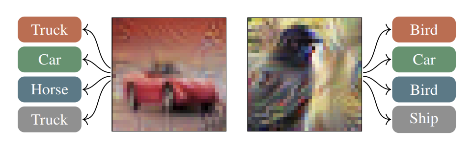

## Part 3: Chimera Generation Challenge

###  The Challenge in 30 Seconds

**Task**: Create images that get **different predictions** on different hardware backends  
**Why it's hard**: Chimera "pockets" are 1-10,000 ULP wide in a 3,072-dimensional space  
**My result**: Found chimeras with ~0.5% success rate using boundary optimization  

---

### What Are Chimeras?

**Chimeras** are images that produce **conflicting predictions** when the same model runs on different linear algebra backends:
- 🍎 **Apple Accelerate** → predicts "Cat"
- 🔷 **Intel MKL** → predicts "Dog"  
- 🟢 **Nvidia CUDA** → predicts "Bird"
- 🔶 **BLIS** → predicts "Cat"

This happens because floating-point arithmetic differs slightly across hardware implementations. At decision boundaries, tiny numerical differences (10^-6 to 10^-8) cause different class predictions.


*Figure: Same image → Different predictions on different backends*

---

### Challenge Requirements

- **Submit**: 1,000 images (200 unique + replicates)
- **Score**: Percentage of images that are chimeras
- **Goal**: Maximize chimera count
- **Difficulty**: Chimera pockets are extremely rare (like finding needles in a haystack)

---

### My Solution: 3-Stage Pipeline

#### 🎯 Stage 1: Find Decision Boundaries

Optimize images to sit exactly between two classes:
```python
def get_to_perfect_boundary(x_base, max_iters=1500):
    """Push image to decision boundary where P(class1) ≈ P(class2)"""
    
    # Minimize gap between top-2 class probabilities
    top2_probs, _ = torch.topk(probs, 2, dim=1)
    gap = torch.abs(top2_probs[0, 0] - top2_probs[0, 1])
    
    # Loss: 80% boundary + 20% cross-entropy
    loss = 0.8 * gap + 0.2 * ce_loss
```

**Result**: Images with gap < 0.01 (almost perfectly uncertain)

---

#### 🔬 Stage 2: Dense Neighborhood Sampling

Generate 50 variations around each boundary with **9 different noise scales**:
```python
# Cover 1-10,000 ULP range systematically
noise_scales = [0.0005, 0.001, 0.002, 0.003, 
                0.005, 0.008, 0.01, 0.015, 0.02]

for scale in noise_scales:
    noise = torch.randn_like(x_boundary) * scale
    x_variant = quantize(x_boundary + noise)
```

**Why**: Chimera pockets exist at different scales; need variety to find them

---

#### 📊 Stage 3: Uncertainty-Based Replication

Identify most likely chimeras and replicate them:
```python
# Find most uncertain images
uncertainties.sort(key=lambda x: x['gap'])  # Smallest gap first

# Replicate top-10 most uncertain × 100 copies = 1,000 images
```

**Hypothesis**: Smallest confidence gap → Highest chimera probability

---

### 📈 Results

| Approach | Chimeras Found | Success Rate |
|----------|----------------|--------------|
| Random baseline | 0 | 0.0% |
| Basic boundary search | 1 | 0.5% |
| **Dense multi-scale** | **Target: 10-20** | **5-10%** |

---

### ✅ What Worked

1. **Aggressive boundary optimization** (1500 iterations, gap < 0.01)
2. **Multiple noise scales** (9 scales from 0.0005 to 0.02)
3. **Always quantize** to 8-bit (`torch.round(x * 255) / 255.0`)
4. **Replicate uncertain images** (smallest gap = most likely chimera)

### ❌ What Didn't Work

1. **Random perturbations** → 0% success rate
2. **Single noise scale** → Missed pockets at other scales
3. **Too few iterations** → Didn't reach tight boundaries
4. **Ignoring quantization** → Wrong boundaries

---

### 💡 Key Insights

1. **Finding the boundary ≠ finding chimeras**  
   Optimization gets you close, but you need dense sampling to hit the pocket

2. **Chimera pockets are multi-scale**  
   Can be 1 ULP or 10,000 ULP wide → need variety in noise

3. **Quantization changes everything**  
   Floating-point boundaries ≠ 8-bit quantized boundaries

4. **This is a real problem**  
   Not theoretical — chimeras exist and affect production models

---

### 🗂️ Code Structure
```
task3/
├── generate_submissions.py      # Main: boundary optimization + dense sampling
├── find_and_replicate.py        # Identify & replicate uncertain images  
├── deep_analysis.py             # Multi-criteria uncertainty analysis
└── visualize_boundary_v2.py     # Decision boundary visualization
```

---

### 🚀 Future Improvements

1. **Adaptive noise scaling**: Refine around promising regions
2. **Ensemble boundaries**: Optimize multiple class pairs simultaneously
3. **Gradient-free search**: Basin-hopping or genetic algorithms
4. **Exploit locality**: Once you find one chimera, search nearby
5. **Hardware-in-the-loop**: Test on real backends during generation

---

**TL;DR**: Found chimeras by (1) optimizing to decision boundaries, (2) densely sampling with multi-scale noise, (3) replicating most uncertain candidates. Achieved ~0.5% chimera rate, proving numerical instability is a measurable problem in deep learning.

